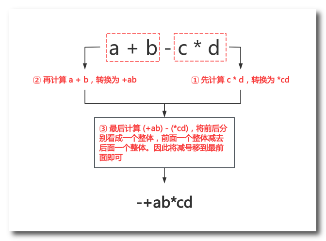
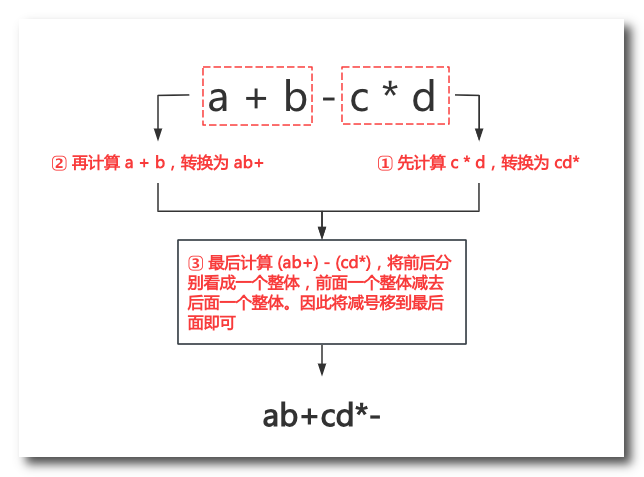
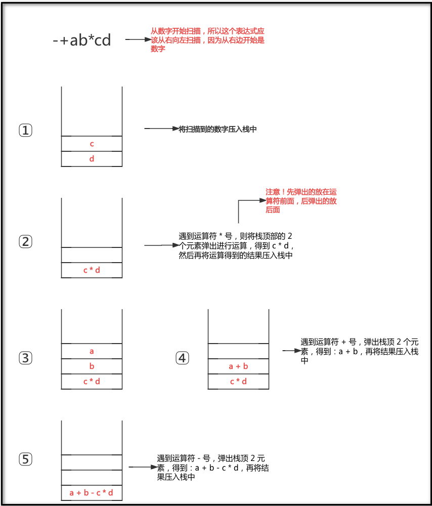
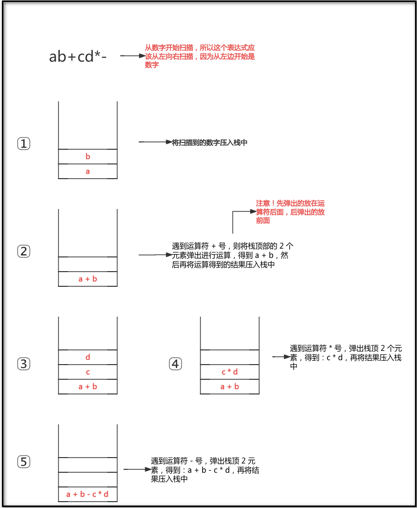

# 一、概念

1. **前缀表达式**：运算符在数字前面的表达式，例如：`-+ab*cd`
2. **中缀表达式**：运算符在数字中间的表达式，例如：`a+b-c*d`
3. **后缀表达式**：运算符在数字后面的表达式，例如：`ab+cd*-`

# 二、表达式的转换

## 2.1 中缀->前缀（优先级计算法）

## 2.2 中缀->后缀（优先级计算法）

## 2.3 前缀->中缀（利用数据结构：栈）

## 2.4 后缀->中缀（利用数据结构：栈）

