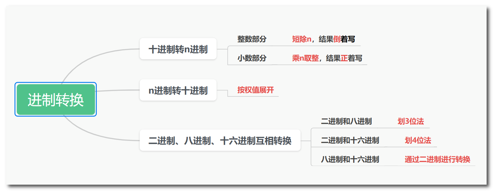
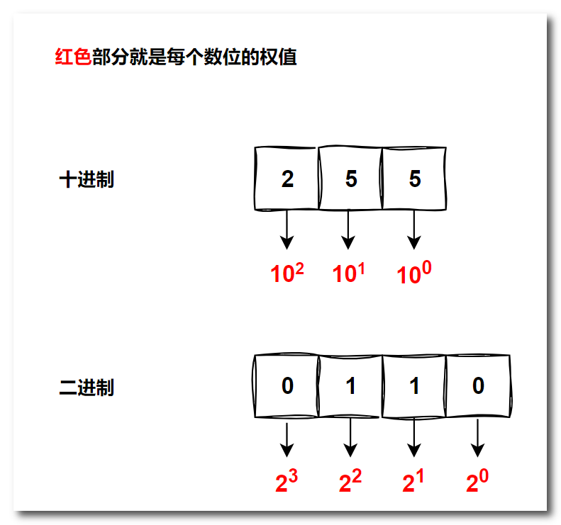
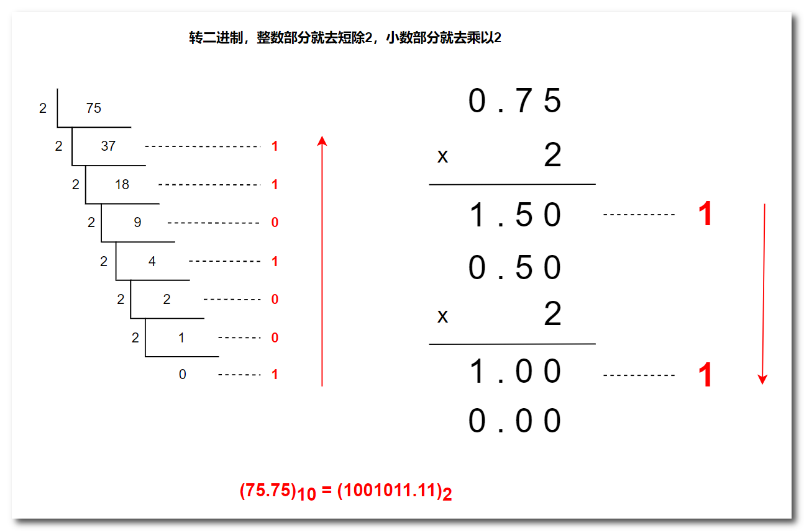
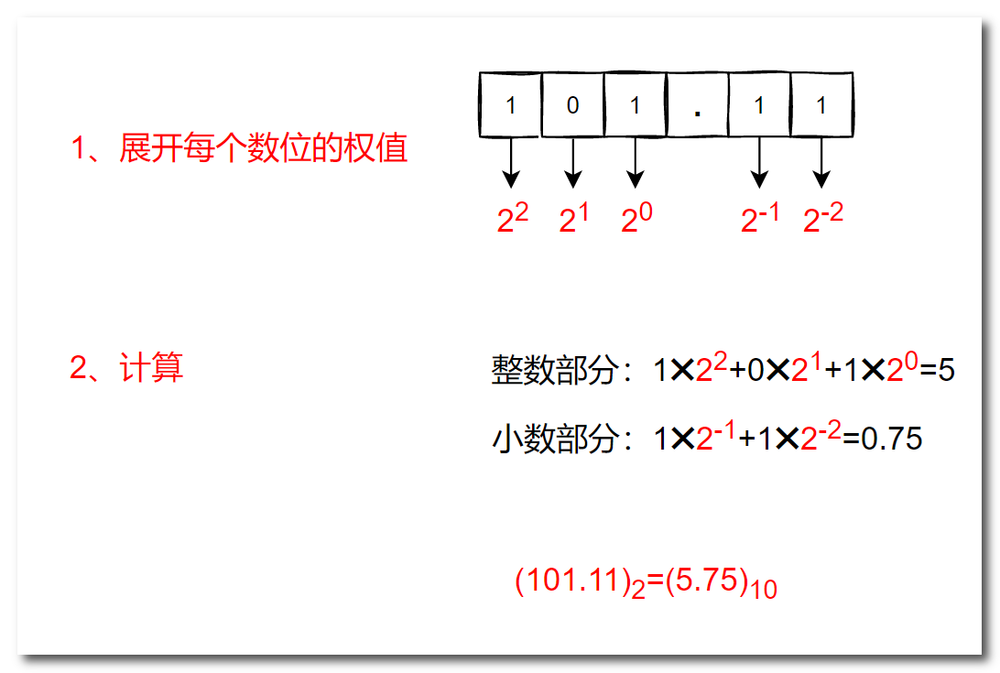
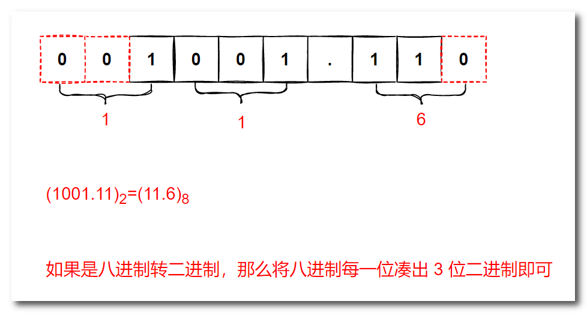
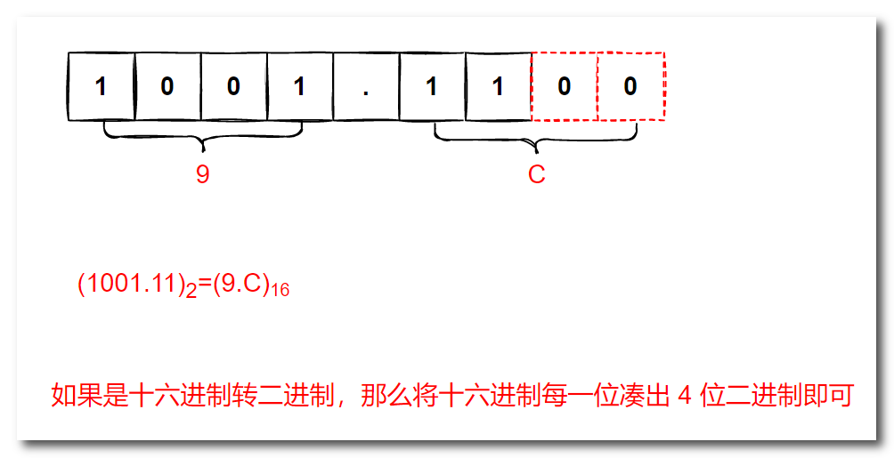

# 一、权值和基数

**基数**：某进制的数位上能够填写的有效数字的个数

|   进制   |                           有效数字                           | 后缀表示 | 前缀表示 | 基数 |
| :------: | :----------------------------------------------------------: | :------: | :------: | :--: |
|  十进制  |                             0~9                              |    D     |    无    |  10  |
|  二进制  |                             0~1                              |    B     |    0b    |  2   |
|  八进制  |                             0~7                              |    O     |    0     |  8   |
| 十六进制 | 0~9、A、B、C、D、E、F（字母分别表示 10、11、12、13、14、15） |    H     |    0x    |  16  |

**权值**： $基数^{位置}$ （基数的位置编号次方）  

# 二、十进制转n进制

- **整数部分**：短除 n，结果**倒着写**
- **小数部分**：乘 n 取整，结果**正着写**

以上是十进制转换为二进制的方法，那么十进制转换为其他进制的方法都与之相同

# 三、n进制转十进制

- 按权展开

以上是 n 进制转十进制的方法，那么其他进制转十进制同样也是**按权展开**

# 四、二、八、十六进制互相转换

首先需要知道，我们可以使用 **1 位八进制来表示 3 位二进制**，可以使用 **1 位十六进制来表示 4 位二进制**，这是为什么呢？因为 3 位二进制的最小值为 000，最大值为 111，正好对应八进制中的 0 和 7；而 4 位二进制的最小值为 0000，最大值为 1111，正好对应十六进制中的 0 和 F。**小数点左边，从右往左划三（十六进制划四位）位，不够补 0；小数点右边，从左往右划三位，不够补 0**；

**小技巧：1248 法，我们可以发现二进制从右往左 4 位的权值分别是：1 2 4 8，使用这个方法可以加快我们的计算速度**

- 二进制和八进制互相转换

- 二进制和十六进制互相转换

- 八进制和十六进制互相转换，先转为二进制，再转为八进制