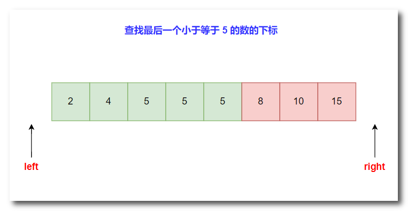
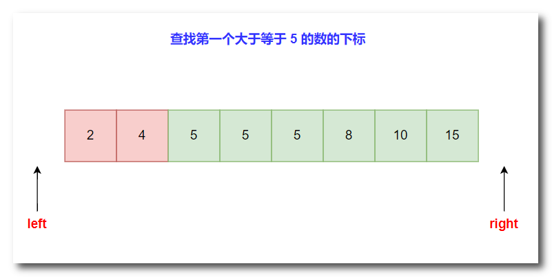

# 一、二分查找

## （一）最大化查找

查找**最后一个 `<=q`** 的数的下标 



**分析**：

> 1. 第一次找到的中点为第 4 个位置的 5，满足 <=5 的条件，left 移动到中点位置，向右继续找，因为此时找到的不一定是最后一个满足条件的数
> 2. 第二次找到的中点为 8，此时不满足 <=5 的条件，right 移动到中点位置，向左继续找
> 3. 第三次找到的中点为第 5 个位置的 5，满足 <=5 的条件，left 移动到中点位置
> 4. 最终返回 left，把左边绿色的区域称为**可行区**

**核心代码如下，n 为数组长度，数据从第 1 个位置开始存储**：

```c++
int find(int q)
{
    int l = 0, r = n + 1;
    while(l + 1 < r)
    {
        int mid = (l + r) / 2;
        if(a[mid] <= q) l = mid;
        else r = mid;
    }
    return l;
}
```

## （二）最小化查找

查找**第一个 `>=q`** 的数的下标



**分析**：

> 1. 第一次找到的中点为第 4 个位置的 5，满足 >=5 的条件，right 移动到中点位置，向左继续找，因为此时找到的不一定是第一个满足条件的数
> 2. 第二次找到的中点为 4，此时不满足 >=5 的条件，left 移动到中点位置，向右继续找
> 3. 第三次找到的中点为第 3 个位置的 5，满足 <=5 的条件，right 移动到中点位置
> 4. 最终返回 right，把右边绿色的区域称为**可行区**

**核心代码如下**：

```c++
int find(int q)
{
    int l = 0, r = n + 1;
    while(l + 1 < r)
    {
        int mid = (l + r) / 2;
        if(a[mid] >= q) r = mid;
        else l = mid;
    }
    return r;
}
```

## （三）浮点数二分

**例题**：求一个浮点数（$-10000<=y<=10000$）的三次方根，结果保留三位小数

**分析**：首先，根据题目，10000 开三次方根一定不会超过 100，因此我们可以设定根的范围为 (-100, 100) 这个开区间内。其次，题目要求精度为保留 3 位小数，那么在二分过程中，只要 `r` 和 `l` 之间的差值小于等于 0.00001（就是1e-5）即可，如此一定可以达到所要求的精度

```c++
#include <bits/stdc++.h>
using namespace std;
double find(double y)
{
    double l = -100, r = 100;
    while(r - l > 1e-5)
    {
        double mid = (l + r) / 2;
        if(mid * mid * mid <= y) l = mid; // 向右找更加接近y的
        else r = mid;
    }
    return l;
}
int main()
{
    double y;
    cin >> y;
    printf("%.3f", find(y));
    
    return 0;
}
```

## （四）总结

1. 二分的搜索次数为：$\log_{2}{n} $，因为每次搜索都砍一半。例如：长度为 16，每次砍一半，结果为：8 -> 4 -> 2 -> 1，只需要搜索 4 次就结束
2. 可行区的指针最后一定会指向答案
3. 使用开区间可以正确处理边界问题
4. `l + 1 = r` 成立时结束

# 二、二分答案

## （一）二分查找和二分答案的区别

> 二分查找和二分答案虽然都使用了二分的思想,但它们有着明显的区别:
>
> **二分查找**
>
> - 目的是在一个有序数组中查找某个特定元素是否存在
>
> - 每次通过与中间元素比较，缩小查找范围
>
> - 需要数组是有序的，否则无法使用二分查找
>
> **二分答案**
>
> - 目的是在一个区间内查找满足某种条件的**最优解**(最大或最小值)
>
> - 通过判断中间值是否满足条件，缩小查找区间
>
> - 需要问题的解具有单调性，即在区间内值越大(或越小)，满足条件的可能性单调增加(或减少)
>
> - 常用于求解最值问题，将最优化问题转化为判定问题
>
> **总的来说,二分查找是查找一个已知的目标值，而二分答案是在一个可行解区间内查找满足条件的最优解。二分答案需要构造一个判定函数来判断当前值是否满足条件，从而缩小查找区间**

## （二）模板

这个 `check` 函数的作用就是去检查当前所尝试的这个答案是否可行，如果在可行范围内，那么就根据题目要求继续去最大化查找或者最小化查找在可行范围内的**更优的答案**

**最大化查找答案**

```c++
bool check(int x)
{
    
}
int find()
{
    int l = 答案的下界 - 1, r = 答案的上界 + 1;
    while(l + 1 < r)
    {
        int mid = (l + r) / 2;
        if(check(mid)) l = mid;
        else r = mid;
    }
    return l;
}
```

**最小化查找答案**

```c++
bool check(int x)
{
    
}
int find()
{
    int l = 答案的下界 - 1, r = 答案的上界 + 1;
    while(l + 1 < r)
    {
        int mid = (l + r) / 2;
        if(check(mid)) r = mid;
        else l = mid;
    }
    return r;
}
```

