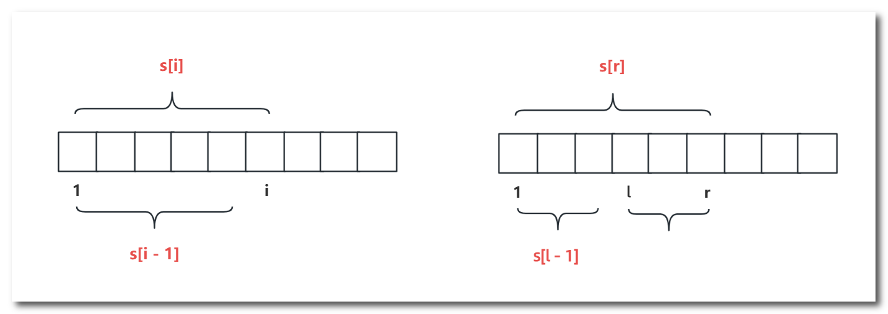
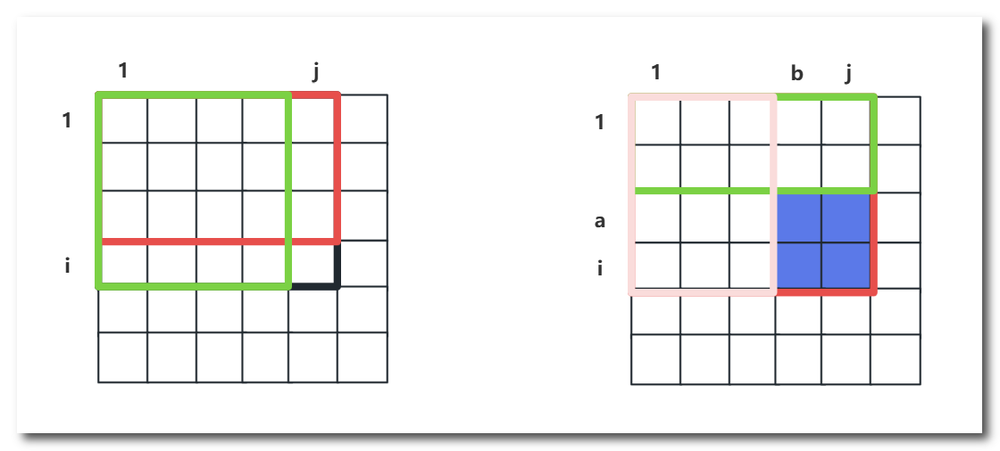

# 一维前缀和

**前缀和**：

序列的前 i 项之和 = 序列的前 i - 1 项之和 + 当前项

$s[i] = s[i - 1] + a[i]$

**区间和**： 

$l$ 到 $r$ 的区间和

$s[r] - s[l - 1]$

# 二维前缀和

**前缀和**：

[1, 1] 到 [i, j] 之间所有格子的和 = 上区 + 左区 - 左上区 + 当前格

$S_{i,j}= S_{i-1,j}+ S_{i,j-1}- S_{i-1,j-1}+ a_{i,j}$

**区间和**：

[a, b] 到 [i, j] 的区间和 = 全区 - 上区 - 左区 + 左上区

$S_{ab,ij}= S_{i,j}- S_{a-1,j}- S_{i,b-1}+ a_{a-1,b-1}$

